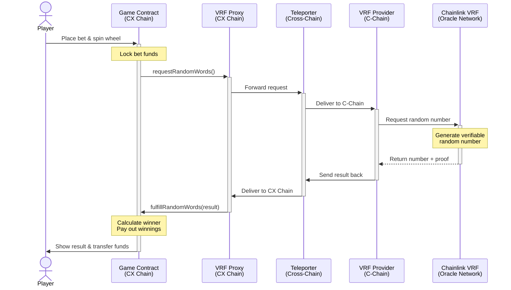

# Verifiable Random Function Integration

## The Fairness Problem (And How We Solve It)

Here's the thing about blockchain gaming: generating truly random numbers is harder than it sounds. Most smart contracts use something like block hashes or timestamps for "randomness," which seems reasonable until you realize miners and validators can manipulate these values. That's not random—that's exploitable.

CX Chain uses Chainlink VRF (Verifiable Random Function) to generate cryptographically secure random numbers with mathematical proofs. When a game needs randomness, the system doesn't trust anyone—not us, not the validators, not even the players. It trusts math.

## Why Block Hashes Don't Work

Let me show you the naive approach many projects use:

```javascript
// DON'T DO THIS - it's vulnerable to manipulation
uint256 random = uint256(keccak256(abi.encodePacked(
    block.timestamp,
    block.difficulty,
    msg.sender
)));
```

This looks random, but it's not. Miners control `block.timestamp` and `block.difficulty`. They can manipulate these values or choose not to mine a block if the "random" result doesn't favor them. Validators can front-run transactions after seeing the upcoming random value. Players can predict future values based on blockchain state.

In short: it's exploitable at every level. For a casino, that's unacceptable.

## What Makes VRF Different

Verifiable Random Functions flip the trust model entirely. Instead of trusting that randomness is fair, you can mathematically verify it. Here's what VRF guarantees:

**Unpredictability**: Nobody can know or influence the random value before it's generated—not players, not developers, not validators, not even the Chainlink oracles generating it.

**Verifiability**: Every random number comes with a cryptographic proof. You can personally verify that the number was generated correctly without trusting anyone's word.

**Tamper-Resistance**: Once a randomness request is submitted, nobody can change the outcome. The cryptographic commitment prevents post-request manipulation.

**Transparency**: Everything happens on-chain. Every request, every random value, every proof—all publicly auditable forever.

Think of it like rolling dice inside a locked glass box. You can see the dice, you can verify they weren't loaded, and you can watch them roll without anyone being able to touch them. That's VRF.

## How It Actually Works (The Technical Magic)

CX Chain doesn't run Chainlink VRF directly on our chain. Instead, we use Avalanche's cross-chain architecture to bridge randomness requests from CX Chain to Avalanche's C-Chain, where Chainlink operates. Let me break down the components:

**On CX Chain**: Your game contracts need randomness, and a VRF Proxy acts as the gateway. When a game needs a random number, it talks to the proxy.

**On Avalanche C-Chain**: The VRF Provider interfaces with Chainlink's oracle network. This is where the actual random number generation happens—Chainlink creates the random value and the cryptographic proof.

**Bridging Between Chains**: Avalanche Teleporter handles the cross-chain messaging. It relays requests from CX Chain to C-Chain and brings the random results back.

:::info Why Cross-Chain?
Chainlink VRF is already battle-tested on major chains like Ethereum and Avalanche C-Chain. Instead of reinventing the wheel and hoping we didn't introduce vulnerabilities, we bridge to proven infrastructure. It's more complex architecturally, but way more secure.
:::

### The Journey of a Random Number

Let me walk you through what happens when you spin a roulette wheel. It's more complex than you'd expect, but the complexity is what makes it secure.

**Step 1: You Spin** — You click the button in the game. Your bet gets locked in the smart contract on CX Chain, and the contract requests randomness from the VRF Proxy.

**Step 2: Request Goes Cross-Chain** — The VRF Proxy packages your randomness request and sends it to Avalanche C-Chain via Teleporter. This is a cross-chain message that gets relayed by Avalanche's infrastructure.

**Step 3: Chainlink Gets Involved** — On C-Chain, the VRF Provider receives your request and forwards it to Chainlink's VRF coordinator. A LINK token payment is processed to pay for the oracle service.

**Step 4: Random Number Generated** — Chainlink oracles do their magic off-chain. They generate a random value using secure methods and create a cryptographic proof that the randomness was generated correctly. This happens outside any blockchain to prevent manipulation.

**Step 5: Result Returns to C-Chain** — Chainlink submits the random value and proof back to C-Chain. The VRF Provider validates the proof (confirming the randomness is legit) and prepares to send it back to CX Chain.

**Step 6: Back to CX Chain** — The random value gets bridged back to CX Chain via Teleporter. The VRF Proxy receives it and calls your game contract's callback function.

**Step 7: Your Game Resolves** — The game contract receives the verified random number, calculates whether you won or lost, and distributes the payout accordingly. All of this is transparent and auditable on-chain.

The whole process takes a few seconds, and every step is logged on-chain. You can trace the entire journey of the random number from request to resolution.

### Visual Diagram



---

## Games That Use VRF

CX Chain has several game contracts already deployed and operational. Each one uses the VRF system to ensure provably fair outcomes. Let's look at what's available.

### Roulette

CX Chain offers European roulette with numbers 0 through 36 and all the classic bet types you'd expect: straight bets on individual numbers, color bets (red/black), odd/even, dozens, columns, streets, splits, and corners. Every spin uses VRF to generate the winning number, ensuring complete fairness.

The roulette contracts come in different variants to balance gas efficiency and user experience. Some implementations use a manual claim mechanism where you place your bet, wait for VRF to generate the outcome, then claim your winnings in a separate transaction if you won. This approach requires an extra step but costs less overall in gas fees. Other variants offer automatic payouts that distribute winnings immediately when the VRF result arrives, trading convenience for higher transaction costs.

Players can choose the variant that matches their preference—whether they prioritize lower fees or streamlined gameplay.

### Wheel Games

Picture a prize wheel divided into segments, each with its own reward value and probability. You place your bet, VRF spins the wheel, and wherever it lands determines your prize. The beauty of wheel games is their flexibility—different segments can have wildly different payouts, from small frequent wins to rare jackpots.

The randomness is completely fair thanks to VRF. Over thousands of spins, the distribution matches the programmed probabilities exactly. You're not trusting the operator to be fair; you're trusting mathematics to be consistent. Multiple prize tiers make wheel games exciting while maintaining the house edge that keeps liquidity providers profitable.

### Dice Games

Dice games on CX Chain are refreshingly simple: VRF rolls the dice, and you bet on the outcome. The classic mechanics translate perfectly to blockchain—you can bet over/under a target number, predict specific results, or choose ranges. Each bet type comes with its own multiplier based on the mathematical probability.

What makes dice games popular is the favorable odds. While roulette has a 2.7% house edge, dice games often have lower edges, giving players better odds while still ensuring long-term profitability for the liquidity pools. It's a sweet spot between player fairness and sustainable economics.

### Range Games

Range games offer a simple but engaging mechanic: you choose a numerical range, and VRF generates a random number. If the result falls within your chosen range, you win. The wider your range, the higher your chances of winning but the lower the payout multiplier. The narrower your range, the riskier the bet but the bigger the potential reward.

This creates an interesting risk-reward dynamic where players can customize their betting strategy. Want high probability with modest returns? Pick a wide range. Feeling lucky and want a big multiplier? Go narrow. Every outcome is determined by VRF, ensuring complete fairness regardless of your range selection.

### Building Your Own VRF-Enabled Game

If you're a developer, integrating VRF is straightforward. You inherit from a base contract that handles all the cross-chain complexity. Here's a simplified example of how a roulette contract works:

```solidity
// Your game inherits from VRFConsumerBase
contract MyRouletteGame is VRFConsumerBase {
    
    struct Bet {
        address player;
        uint256 amount;
        uint256 timestamp;
    }
    
    mapping(uint256 => Bet) public bets;
    
    // Player places bet and requests randomness
    function placeBet() external payable {
        require(msg.value >= minBet, "Bet too small");
        
        // Request random number from VRF
        uint256 requestId = requestRandomWords(
            1,        // How many random numbers you need
            100000    // Gas limit for the callback
        );
        
        // Store the bet with the request ID
        bets[requestId] = Bet({
            player: msg.sender,
            amount: msg.value,
            timestamp: block.timestamp
        });
    }
    
    // VRF calls this function when randomness arrives
    function fulfillRandomWords(
        uint256 requestId,
        uint256[] memory randomWords
    ) internal override {
        Bet memory bet = bets[requestId];
        
        // Convert random number to roulette outcome (0-36)
        uint256 outcome = randomWords[0] % 37;
        
        // Check if player won and pay them
        if (isWinningBet(bet, outcome)) {
            uint256 payout = calculatePayout(bet);
            payable(bet.player).transfer(payout);
        }
    }
}
```

The base contract handles all the cross-chain messaging, VRF coordination, and proof verification. You just call `requestRandomWords()` when you need randomness and implement `fulfillRandomWords()` to handle the result. Simple.

:::tip Development Resources
The CX Chain repository includes VRF consumer base contracts, reference implementations of all the live games, a testing framework with VRF mocks (so you don't need to wait for cross-chain responses during development), and deployment scripts. Don't start from scratch—use the battle-tested libraries.
:::

---

## Verifying Fairness Yourself

### Don't Trust, Verify

The entire point of VRF is that you don't have to trust anyone. Let me show you how to personally verify any game outcome.

**Step 1**: Find the VRF request transaction on CX Chain. This shows when randomness was requested and locks in the bet details.

**Step 2**: Find the corresponding VRF fulfillment on C-Chain. This is where Chainlink submitted the random number and proof.

**Step 3**: Extract the random value and cryptographic proof from the C-Chain transaction.

**Step 4**: Verify the proof mathematically. Use Chainlink's public key to confirm the random number was generated correctly. This is pure cryptography—either it validates or it doesn't.

**Step 5**: Recalculate the game outcome yourself using the verified random number. For roulette, that's just `randomNumber % 37` to get the winning number.

**Step 6**: Compare your calculated outcome to what the contract actually did. They should match perfectly.

If everything checks out, you have mathematical proof the game was fair. No trust required—just math.

:::info Who Do You Trust?
Traditional online casinos: Trust the operator.  
Block hash randomness: Trust the validators.  
Chainlink VRF: Trust the cryptographic proof (which is verifiable math, not a person).

That's the difference.
:::

---

## Where to Go From Here

You now understand how VRF makes gaming provably fair on CX Chain. The cross-chain architecture is complex, but it leverages battle-tested Chainlink infrastructure instead of reinventing cryptography. The timing vulnerability exists but is mitigatable through proper game design.

Want to understand how liquidity providers earn from these games? Check out [Liquidity Pools](/docs/tutorial-basics/what-are-liquidity-pools).

Want to understand the token economics that power the whole system? Read about [Token Economics](/docs/tutorial-basics/intro-to-cx-chain-tokens).

Or just head to the CX Chain app and try a game. Every spin is provably fair, and now you know exactly why.