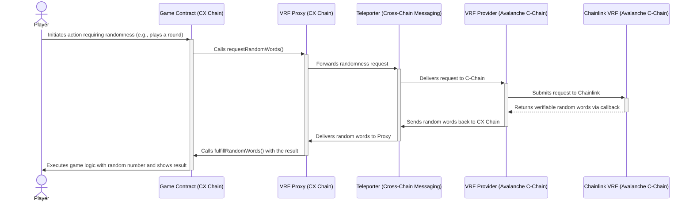

#  Verifiable Randomness for Fair Gameplay

CX Chain uses **Chainlink's Verifiable Random Function (VRF)** to provide a secure and transparent source of on-chain randomness, ensuring that all game outcomes are fair and unpredictable. This service operates through a cross-chain communication process between CX Chain and the Avalanche C-Chain.

#### How It Works: The Core Components

The process involves a few key smart contracts working together across different chains:

*   **Game Contract (on CX Chain):** The dApp or game that requires a random number to execute its logic.
*   **VRF Proxy (on CX Chain):** The on-chain gateway for games. It receives randomness requests and delivers the final number back to the game.
*   **VRF Provider (on Avalanche C-Chain):** This contract receives requests from the CX Chain proxy and communicates directly with Chainlink VRF to generate the random value.
*   **Teleporter:** The cross-chain messaging protocol that allows the `VRF Proxy` on CX Chain to communicate with the `VRF Provider` on the C-Chain.

#### The Random Number Generation Flow

1.  **Request Initiated:** A game on CX Chain requests a random number from the `VRF Proxy`.
2.  **Cross-Chain Request:** The `VRF Proxy` uses Teleporter to send the request to the `VRF Provider` on the Avalanche C-Chain.
3.  **Chainlink Interaction:** The `VRF Provider` submits the request to Chainlink VRF for secure generation of a random number.
4.  **Cross-Chain Return:** Chainlink returns the verifiable random number to the `VRF Provider`, which then uses Teleporter to send it back to the `VRF Proxy` on CX Chain.
5.  **Request Fulfilled:** The `VRF Proxy` delivers the random number to the original game contract.
6.  **Game Logic Executes:** The game uses the random number to determine a provably fair outcome, such as dealing a card or rolling a dice.

#### Important Considerations

*   **Security Note:** Because this process involves multiple transactions across chains, there is a potential for **front-running**. An attacker could theoretically monitor the mempool and see the random value after it's generated but before it's confirmed on CX Chain. Developers should account for this latency in their smart contract design.