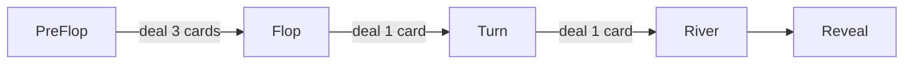
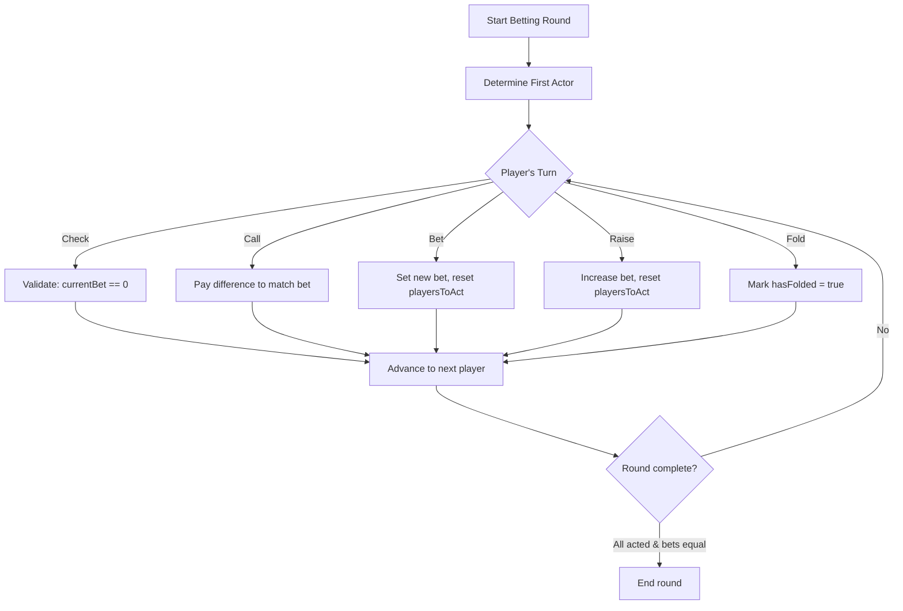
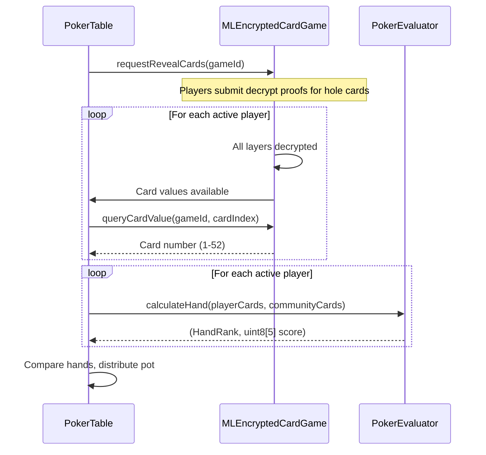
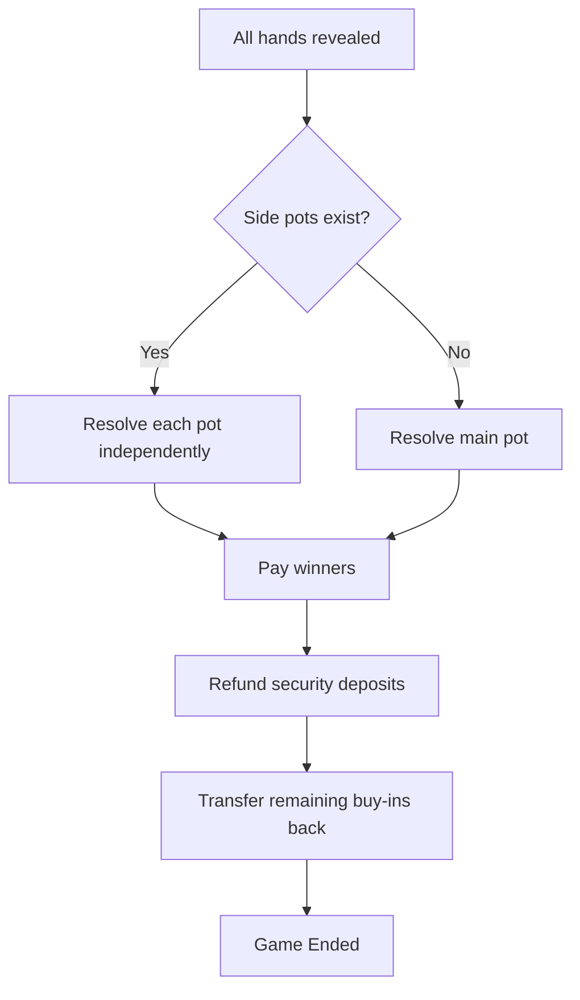

# Betting, Hand Evaluation & Winnings

## Betting Rounds

Texas Hold'em has four betting rounds, each followed by community card dealing:



| Round | Community Cards | Total Visible |
|-------|----------------|---------------|
| **PreFlop** | None | 2 hole cards only |
| **Flop** | 3 dealt | 5 cards |
| **Turn** | 1 dealt | 6 cards |
| **River** | 1 dealt | 7 cards |

### Blinds

At the start of each hand, the two players after the dealer post forced bets:
- **Small blind**: Posted by the player to the dealer's left
- **Big blind**: Posted by the next player (2x small blind)

The dealer position rotates each hand.

## Player Actions

During each betting round, players act in seat order. Available actions depend on the current state:

```solidity
enum PlayerAction { None, Check, Call, Bet, Raise, Fold }
```

| Action | When Available | Effect |
|--------|---------------|--------|
| **Check** | No outstanding bet to match | Pass without betting |
| **Call** | There is an outstanding bet | Match the current bet |
| **Bet** | No one has bet this round | Set a new bet amount |
| **Raise** | There is an outstanding bet | Increase the current bet |
| **Fold** | Any time | Surrender hole cards, forfeit all bets |

### Betting Logic (`PlayerActionLogic`)



**Round ends when:**
- All non-folded, non-all-in players have acted
- All active players' bets are equal
- Only one player remains (everyone else folded)

### Bet Clamping (All-In)

When a player bets or calls more than their remaining buy-in, the bet is **clamped** to their available chips and they are marked `isAllIn = true`:

```solidity
function applyBet(Round storage round, PlayerInfo storage player, uint256 amount) internal {
    uint256 actual = amount > player.buyIn ? player.buyIn : amount;
    player.buyIn -= actual;
    player.currentBet += actual;
    player.totalBet += actual;
    round.pot += actual;
    if (player.buyIn == 0) player.isAllIn = true;
}
```

## All-In & Side Pots

When a player goes all-in for less than the current bet, **side pots** are created to ensure fair distribution:

```
Example:
  Player A bets 100 (has 100 remaining → all-in)
  Player B calls 100
  Player C raises to 200
  Player B calls 200

Main pot: 300 (100 × 3 players) — A, B, C eligible
Side pot: 200 (100 × 2 players) — B, C eligible only
```

The contract calculates side pots at showdown by sorting players by their total bets and creating pots proportionally.

## Timeouts

Timeouts prevent players from stalling the game indefinitely.

| Timeout | Default | Applies To |
|---------|---------|------------|
| **Action timeout** | 30 seconds | Player's turn to bet/check/call/raise/fold |
| **Shuffle timeout** | 60 seconds | Player's turn to submit shuffle proof |
| **Decrypt timeout** | 60 seconds | Player's turn to submit decryption layer |
| **Reveal timeout** | 60 seconds | Player's turn to reveal hole cards |

When a timeout expires, any player can call the timeout function. The stalling player:
- May have their security deposit slashed
- Is treated as if they folded (for action timeouts)
- May cause the game to end (for shuffle/decrypt timeouts)

The caller who triggers the timeout receives a **timeout reward** (default 0.5% of pot, configurable), incentivizing players to keep the game moving.

## Hand Evaluation

After the final betting round (River), the game enters the **Revealing** state. Active (non-folded) players must reveal their hole cards.

### Reveal Process



### PokerEvaluator

The `PokerEvaluator` contract runs entirely on-chain. Given 2 hole cards and 5 community cards (7 total), it:

1. **Generates all 21 possible 5-card combinations** (C(7,2) = 21 ways to exclude 2 cards)
2. **Evaluates each combination** for hand rank
3. **Returns the best hand** with a rank and score for tiebreaking

#### Card Parsing

Cards are numbered 1-52 and parsed as:

```solidity
function parseCard(uint256 cardNumber) public pure returns (Card memory) {
    uint8 suit = uint8((cardNumber - 1) / 13);  // 0=Spade, 1=Heart, 2=Diamond, 3=Club
    uint8 rank = uint8((cardNumber - 1) % 13) + 1;  // 1=Ace ... 13=King
}
```

#### Hand Rankings

```solidity
enum HandRank {
    HighCard,        // 0
    OnePair,         // 1
    TwoPair,         // 2
    ThreeOfAKind,    // 3
    Straight,        // 4
    Flush,           // 5
    FullHouse,       // 6
    FourOfAKind,     // 7
    StraightFlush,   // 8
    RoyalFlush       // 9
}
```

Higher `HandRank` value always wins. For ties, the **5-element score array** (`uint8[5]`) is compared element by element. Aces are scored as 14 (high) except in A-2-3-4-5 straights where the Ace counts as 1.

#### Score Packing

For gas-efficient storage, the hand score is packed into a single `uint48`:

```
handScorePacked = rank(8 bits) || score[0](8) || score[1](8) || score[2](8) || score[3](8) || score[4](8)
```

This allows comparing hands with a single integer comparison.

## Winner Determination

After all active players have revealed:

1. **Compare hands**: Using packed scores, highest wins
2. **Handle ties**: Equal scores split the pot evenly
3. **Side pot resolution**: Each pot is resolved independently — only eligible players compete for each pot
4. **Single remaining player**: If everyone else folded, the last player wins automatically (no reveal needed)

## Pot Distribution



Winnings are transferred directly to players in **stAVAX** (or native CX if the table was configured with `asset = address(0)`):
- **stAVAX**: `SafeERC20.safeTransfer`
- **Native CX**: Direct transfer

Security deposits are refunded to all players who weren't slashed for timeouts.

## Fee System

Tables can charge a **rake** (fee) on each pot:

| Parameter | Description | Constraint |
|-----------|-------------|------------|
| `feeBps` | Rake in basis points (1 bp = 0.01%) | Max 1000 (10%) |
| `feeRecipient` | Address that receives the rake | Cannot be zero if `feeBps > 0` |

The fee is deducted from the pot before distribution to winners.

## Financial Security

| Protection | Mechanism |
|------------|-----------|
| **Escrow** | All buy-ins and deposits held in the contract until game ends |
| **Reentrancy guard** | `ReentrancyGuard` on all external functions that transfer value |
| **Automatic refunds** | Unused buy-in + security deposit returned after each hand |
| **No stuck funds** | Game end logic ensures all funds are distributed |
| **ERC20 safety** | `SafeERC20` for all token transfers (handles non-standard return values) |

## Events

```solidity
event PlayerAction(uint256 indexed roundId, address player, uint8 action, uint256 amount);
event BettingRoundStarted(uint256 indexed roundId, uint8 round);
event BettingRoundEnded(uint256 indexed roundId, uint8 roundIndex);
event PotUpdated(uint256 indexed roundId, uint256 pot);
event DealerButtonMoved(uint256 indexed roundId, uint8 newPosition);
event GameStateChanged(uint256 indexed roundId, GameState newState);
```
