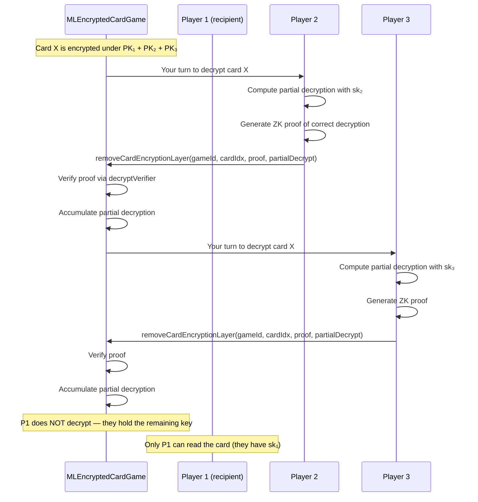

# Dealing & Decryption

After the shuffle completes, the deck is encrypted under every player's key. To deal a card, the encryption layers must be peeled off — but **selectively**, so that only the intended recipient can read the card.

## Deal Sequences

The game contract specifies which cards go to which player using `DealSequence` structs:

```solidity
struct DealSequence {
    BitMap256 cards;       // Bitmask of card indices to deal
    address   playerAddr;  // Recipient (or address(0) for community cards)
}
```

For example, in Texas Hold'em:
- **Hole cards**: 2 cards per player, each in a separate `DealSequence` targeted to that player
- **Flop**: 3 community cards in one `DealSequence` with `playerAddr = address(0)`
- **Turn**: 1 community card
- **River**: 1 community card

```solidity
function deal(
    uint256 gameId,
    DealSequence[] calldata dealSequence,
    bytes calldata next  // Callback for game contract
) external onlyGameOwner(gameId)
```

## Progressive Decryption

This is the core privacy mechanism. Because the deck is encrypted under the **aggregated** public key (all players' keys combined), revealing a card requires every player to remove their individual encryption layer.



### How It Works Step by Step

1. **Card encrypted under all keys**: After shuffle, each card's ciphertext is `(c0, c1)` where `c1 = M + r * PK_agg`

2. **Each non-recipient player decrypts**: Player `i` computes their partial decryption:
   ```
   d_i = sk_i * c0
   ```
   and submits it with a ZK proof that `d_i` was computed correctly using their secret key `sk_i` (without revealing `sk_i`).

3. **Contract accumulates**: The contract adds up all partial decryptions via point addition:
   ```
   D = d₂ + d₃ + ... + dₙ   (everyone except the recipient)
   ```

4. **Recipient reads the card**: The recipient computes:
   ```
   M = c1 - D - sk₁ * c0
   ```
   Since `D + sk₁ * c0 = (sk₁ + sk₂ + ... + skₙ) * c0 = r * PK_agg * c0/c0 = r * PK_agg`, the original card point `M` is recovered. Only the recipient has `sk₁`, so only they can complete this computation.

### Why This Is Secure

| Scenario | Who decrypts | Who can read |
|----------|-------------|--------------|
| **Player's hole cards** | Everyone *except* the card owner | Only the card owner (they hold the remaining key) |
| **Community cards** | *All* players decrypt | Everyone can read |

- No single party ever has enough information to reveal another player's hole cards
- Each decryption step is verified with a ZK proof — players can't submit garbage
- The contract tracks which players have decrypted via a **bitmap per card** (`decryptRecord`)

## On-Chain Verification

Each call to `removeCardEncryptionLayer()` includes a Groth16 proof verified by `decryptVerifier.verifyProof()`. The proof attests that:

- The player used their actual secret key (the one matching their registered public key)
- The partial decryption value is mathematically correct
- No information about the secret key is leaked

```solidity
// Simplified — actual function has more parameters
function removeCardEncryptionLayer(
    uint256 gameId,
    uint256 cardIndex,
    uint256[8] calldata proof,
    Point calldata partialDecrypt
) external
```

## Decrypt Record

The contract maintains a **bitmap per card** to track which players have contributed their decryption layer:

```solidity
// In Deck struct:
mapping(uint256 => BitMap256) decryptRecord;
// decryptRecord[cardIndex] bit i = 1 means player i has decrypted
```

Additionally, accumulators track the running sum of partial decryptions:

```solidity
mapping(uint256 => uint256) accumX;  // Accumulated x-coordinate
mapping(uint256 => uint256) accumY;  // Accumulated y-coordinate
uint256 totalDecryptsNeeded;         // Expected total decryptions
uint256 totalDecryptsDone;           // Completed so far
```

When `totalDecryptsDone == totalDecryptsNeeded`, the decryption phase is complete and the game can transition to the next state.

## Card Value Recovery

Once a card is fully decrypted (all required layers removed), the contract can identify which card it is:

```solidity
function queryCardValue(
    uint256 gameId,
    uint256 cardIndex
) external view returns (uint256)
```

This function takes the final x-coordinate of the decrypted card and matches it against the 52 known initial deck values. The returned integer (1-52) identifies the card:

| Value | Card |
|-------|------|
| 1-13 | Spades A through K |
| 14-26 | Hearts A through K |
| 27-39 | Diamonds A through K |
| 40-52 | Clubs A through K |

If no match is found, `INVALID_INDEX` (999999) is returned, indicating an error in decryption.

## Batch Decryption

To reduce gas costs, players can decrypt up to **16 cards in a single Groth16 proof** using `batchRemoveCardEncryptionLayer()`. The batch circuit (`BatchDecrypt(16)`) proves all 16 decryptions used the same secret key, but only requires one on-chain verification (~300K gas total instead of ~300K per card).

```solidity
function batchRemoveCardEncryptionLayer(
    uint256 gameId,
    uint256[] calldata cardIndices,
    uint256[8] calldata proof,
    Point[] calldata partialDecrypts
) external
```

Unused slots (when fewer than 16 cards need decrypting) are filled with a constant padding point on both the circuit input and contract side.

## Parallel Decryption

The contract supports **parallel decryption** — multiple players can submit their decryption layers for different cards simultaneously. The accumulator pattern (`accumX`, `accumY`) allows out-of-order submissions. The game only needs to wait until all required decryptions for a given phase are done.

## Decrypt Timeouts

Each player has **60 seconds** (configurable) to submit their decryption layer. If they fail:

- Any player can trigger the timeout
- The stalling player's security deposit may be slashed
- A timeout reward (default 0.5% of pot) goes to the caller
- The game handles the situation (may end or continue without the stalled player)

## Off-Chain Prover

ZK proof generation is computationally expensive and happens **off-chain**. The backend system uses:

- **Circom circuits** compiled to WASM for proof witness generation
- **rapidsnark** (C++ prover) for fast Groth16 proof computation
- A **worker pool** to generate shuffle and decrypt proofs in parallel
- Proofs are submitted to the contract where they are verified on-chain

The on-chain verification is lightweight (a single pairing check), while the heavy computation happens client-side or on the game backend.
