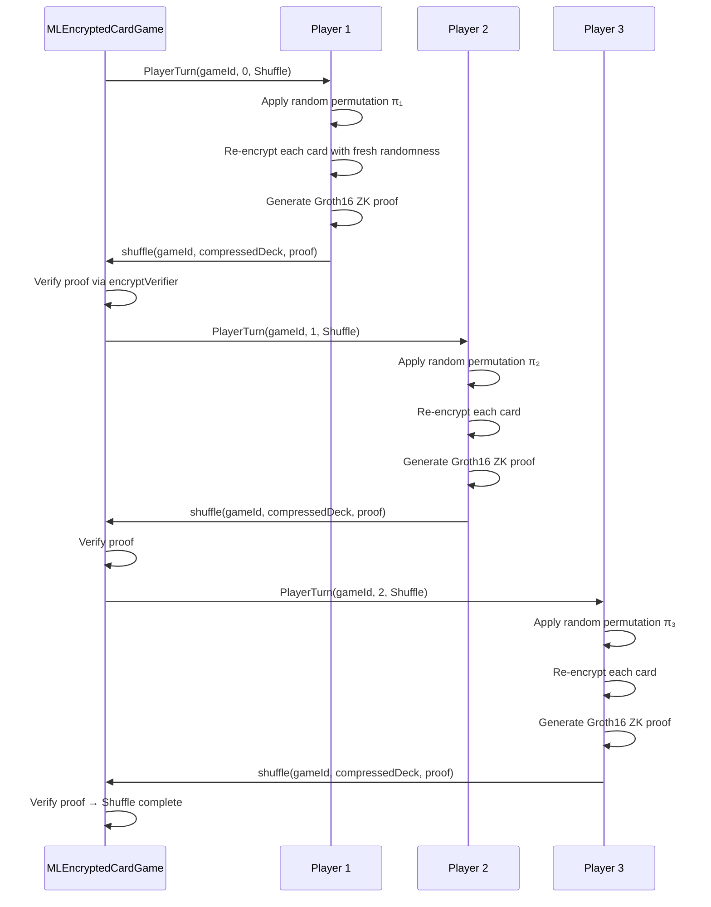

# Shuffle & Encryption System

The card game platform uses a **mental poker** protocol — a cryptographic technique that allows players to shuffle and deal cards without a trusted dealer. Every shuffle is verified on-chain with Groth16 zero-knowledge proofs.

## Card Encoding

Each of the 52 cards is mapped to a unique point on the **BabyJubJub elliptic curve**. The curve is defined over a prime field and is SNARK-friendly, meaning ZK proofs over its operations are efficient.

```
Card 1  → (x₁, y₁)   on BabyJubJub
Card 2  → (x₂, y₂)   on BabyJubJub
  ...
Card 52 → (x₅₂, y₅₂) on BabyJubJub
```

Each card's identity is determined by its **x-coordinate**. The initial deck of 52 predefined (x, y) pairs is hardcoded in the contract. After shuffling and encryption, card values are hidden — but once fully decrypted, the x-coordinate is matched back against the initial deck to recover the card's identity.

### Compressed Deck Format

To save gas, decks are stored in compressed form:

```solidity
struct CompressedDeck {
    uint256[] x0;     // x-coordinates of first point per card
    uint256[] x1;     // x-coordinates of second point per card
    BitMap256 selector0;  // sign bit for recovering y₀
    BitMap256 selector1;  // sign bit for recovering y₁
}
```

Each card has **two** elliptic curve points `(x0, y0)` and `(x1, y1)` — these are the two components of the ElGamal ciphertext. The y-coordinates are recoverable from x + selector bit, so only x-coordinates and a bitmap of sign bits need to be stored on-chain.

## ElGamal Encryption

Cards are encrypted using **ElGamal encryption** on BabyJubJub:

### Key Registration

1. Each player generates a BabyJubJub keypair: secret scalar `sk`, public key `PK = sk * G`
2. On joining, each player submits their public key via `join(roundId, seat, PK)`
3. The contract computes the **aggregated public key** via point addition:
   ```
   PK_agg = PK₁ + PK₂ + ... + PKₙ
   ```
4. A nonce is derived: `nonce = (PK_agg.x * PK_agg.y) mod Q`, binding proofs to this specific set of players

### Encryption Scheme

For a card represented as point `M` on BabyJubJub:

```
Encrypt(M, PK_agg):
    Choose random scalar r
    c0 = r * G          (ephemeral public key)
    c1 = M + r * PK_agg (masked card point)
    Ciphertext = (c0, c1)
```

The card `M` is hidden inside `c1` — recovering it requires knowing the discrete log of `PK_agg`, which means **all players must cooperate** to decrypt.

## Multi-Party Shuffle Protocol

The shuffle follows the classic mental poker approach: each player takes a turn to shuffle and re-encrypt the entire deck. The protocol guarantees that the final deck ordering is random as long as **at least one player is honest**.



### What Each Player Does

On their turn, a player:

1. **Permutes** the deck — applies a random permutation matrix to reorder all 52 cards
2. **Re-encrypts** every card with fresh randomness:
   ```
   For each card (c0, c1):
       Choose random scalar r
       c0' = c0 + r * G
       c1' = c1 + r * PK_agg
   ```
   This changes the ciphertext without changing the underlying card value.
3. **Generates a Groth16 ZK proof** that:
   - The permutation was applied correctly (cards were actually reordered)
   - The re-encryption was done correctly (ElGamal homomorphic property preserved)
   - No cards were added, removed, or duplicated
4. **Submits** the new compressed deck + proof to the contract

### On-Chain Verification

```solidity
function shuffle(
    uint256 gameId,
    CompressedDeck calldata newDeck,
    uint256[8] calldata proof  // Groth16 proof (a, b, c)
) external onlyOnPhase(gameId, Phase.Shuffle) onlyOnTurn(gameId)
```

The contract calls `encryptVerifier.verifyProof()` to verify the ZK proof against the old deck state and the new deck. If verification passes, the new deck replaces the old one and the turn advances to the next player.

### Server Mode

For operator-assisted games, `MLEncryptedCardGame` supports a **server mode** where a designated server operator can perform the shuffle in a single step via `shuffleAsServer()`. The same ZK proof verification applies — the server cannot cheat.

```solidity
function shuffleAsServer(
    uint256 gameId,
    CompressedDeck calldata shuffledDeck,
    uint256[8] calldata proof
) external
```

## Privacy Guarantees

| Guarantee | Mechanism |
|-----------|-----------|
| **No one knows the full permutation** | Each player applies their own secret permutation; the combined shuffle is the composition of all individual permutations |
| **Honest minority suffices** | The deck is randomly shuffled as long as at least one player chose a truly random permutation |
| **ZK proof prevents pass-through** | The proof verifies the player actually shuffled — they can't just submit the deck unchanged |
| **Card identity is hidden** | After re-encryption, the ciphertext looks completely different even though the underlying card is the same (semantic security of ElGamal) |
| **No information leaks** | Compressed storage (x-coordinate + sign bit) reveals nothing about card values |

## Shuffle Timeouts

Each player has a **60-second deadline** to submit their shuffle (configurable per table). If a player fails to shuffle in time:

- Any other player can call the timeout function
- The stalling player's security deposit may be slashed
- A small reward (default 0.5% of pot) is paid to the timeout caller
- The game can proceed or end depending on the situation

## Cryptographic Libraries

| Library | Purpose |
|---------|---------|
| `BabyJubJub.sol` | Elliptic curve point operations (addition, scalar multiplication) |
| `BitMaps.sol` | Gas-efficient bitmaps for card tracking (256 bits in one storage slot) |
| `Pairing.sol` | Bilinear pairing operations for Groth16 proof verification |
| `SSTORE2.sol` | Efficient large-data storage using contract bytecode |
| `Groth16Verifier.sol` | On-chain ZK proof verification |
