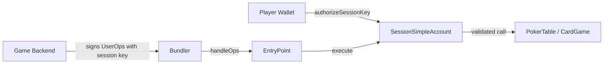
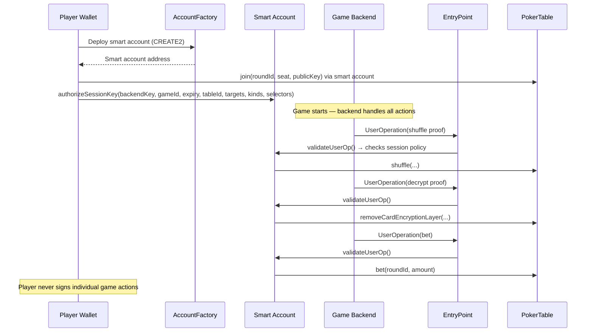

# Smart Wallets & Account Abstraction

## The Problem

A single hand of poker requires many on-chain transactions: shuffle proof, multiple decrypt proofs, bet/call/raise/fold, reveal proof. If a player had to manually approve each one in their wallet, the game would be unplayable.

## The Solution

The platform uses **ERC-4337 smart accounts** with scoped session keys. Players authorize a temporary key that can only call specific game functions for a limited time — the backend signs and submits transactions automatically on their behalf.

## Architecture



## SessionSimpleAccount

The `SessionSimpleAccount` contract is an ERC-4337 compatible smart wallet with two authorization levels:

### Owner (Full Control)

The player's real wallet address. Can:
- Execute arbitrary calls
- Authorize and revoke session keys
- Withdraw funds
- Upgrade the contract (UUPS proxy)

### Session Keys (Scoped Access)

Temporary keys authorized for specific game operations. Defined by a **SessionPolicy**:

```solidity
struct TargetRule {
    address target;   // Allowed contract address
    uint8   kind;     // 0 = generic, 1 = CardGame (gameId check), 2 = PokerTable (tableId check)
}

struct SessionPolicy {
    TargetRule[] targets;     // Allowed contracts (max 4)
    uint256      gameId;     // Required if any target has kind == 1
    uint256      tableId;    // Required if any target has kind == 2
    uint48       validUntil; // Expiration timestamp
    bool         exists;
    bytes4[]     selectors;  // Allowed function selectors (max 12, zero-value calls only)
}
```

### Authorizing a Session Key

Only the owner can create session keys:

```solidity
function authorizeSessionKey(
    address   sessionKey,
    uint256   gameId,
    uint48    validUntil,
    uint256   tableId,
    address[] calldata targets,   // Contract addresses
    uint8[]   calldata kinds,     // Target types
    bytes4[]  calldata selectors  // Allowed function selectors
) external onlyOwner
```

**Constraints enforced on-chain:**
- `sessionKey != address(0)`
- `validUntil > block.timestamp` (not already expired)
- `targets.length == kinds.length`, both between 1 and 4
- `selectors.length` between 1 and 12
- If any target has `kind == 1`, `gameId` must be non-zero
- All target addresses must be non-zero
- All kinds must be 0, 1, or 2

### Example: Poker Session Key

A typical poker session key would allow:

| Target | Kind | Allowed Selectors |
|--------|------|-------------------|
| `PokerTable` | 2 (tableId check) | `join`, `check`, `call`, `bet`, `raise`, `fold`, `reveal` |
| `MLEncryptedCardGame` | 1 (gameId check) | `shuffle`, `removeCardEncryptionLayer` |

The session key **cannot**:
- Transfer funds (zero-value calls only)
- Call functions not in the selector whitelist
- Interact with contracts not in the targets list
- Operate after `validUntil` timestamp
- Act on a different game or table than the one authorized

### Revoking a Session Key

```solidity
function revokeSessionKey(address sessionKey) external onlyOwner
```

Deletes the session policy entirely. The key immediately becomes invalid.

## Player UX Flow



1. **Account creation**: Player's wallet deploys a `SessionSimpleAccount` via the factory (or reuses an existing one — deterministic CREATE2 address)
2. **Join game**: Player joins the table through their smart account
3. **Authorize session**: Player signs one transaction to authorize a session key scoped to this game
4. **Automatic play**: The backend uses the session key to sign UserOperations for shuffles, decrypts, and bets
5. **Game ends**: Session key expires or is revoked

## SessionSimpleAccountFactory

Deploys smart accounts using CREATE2 for deterministic addresses:

```solidity
function createAccount(
    address owner,
    uint256 salt
) external returns (SessionSimpleAccount)
```

The same owner + salt always produces the same address, so the account address can be computed before deployment.

## Gasless Tables (ERC-2771)

For an even smoother experience, tables can be configured with a **trusted forwarder** for ERC-2771 meta-transactions:

```solidity
function initialize(
    ICardGame cardGameManager,
    address   pokerEvaluator,
    address   asset,
    uint256   securityDeposit,
    address   trustedForwarder,  // ERC-2771 forwarder
    address   admin
) external
```

When a trusted forwarder is set:

1. The operator (or a paymaster) pays gas fees
2. Players sign their intent off-chain
3. The forwarder relays the transaction, appending the original sender's address
4. The contract extracts the real sender via `_msgSender()` (ERC-2771 standard)

```solidity
// ERC2771ContextStorage._msgSender()
function _msgSender() internal view returns (address) {
    if (isTrustedForwarder(msg.sender) && msg.data.length >= 20) {
        return address(bytes20(msg.data[msg.data.length - 20:]));
    }
    return msg.sender;
}
```

This means players don't even need native tokens for gas — the table operator covers it.

## Security Summary

| Control | Mechanism |
|---------|-----------|
| **Time-limited** | `validUntil` timestamp — session keys auto-expire |
| **Game-scoped** | `gameId` and `tableId` binding — can't be used on other games |
| **Function-restricted** | Explicit selector whitelist — only game actions allowed |
| **Zero-value only** | Session keys cannot transfer funds |
| **Target-restricted** | Only whitelisted contract addresses |
| **Owner override** | Owner can revoke any session key instantly |
| **UUPS upgradeable** | Contract can be upgraded by owner if needed |

## Execution Methods

```solidity
// Single call
function execute(address dest, uint256 value, bytes calldata func) external

// Batch calls (multiple game actions in one transaction)
function executeBatch(
    address[] calldata dest,
    uint256[] calldata value,
    bytes[]   calldata func
) external
```

Both require the caller to be the EntryPoint or the owner. The `executeBatch` variant allows combining multiple game actions (e.g., multiple decrypt proofs) into a single transaction for gas efficiency.
