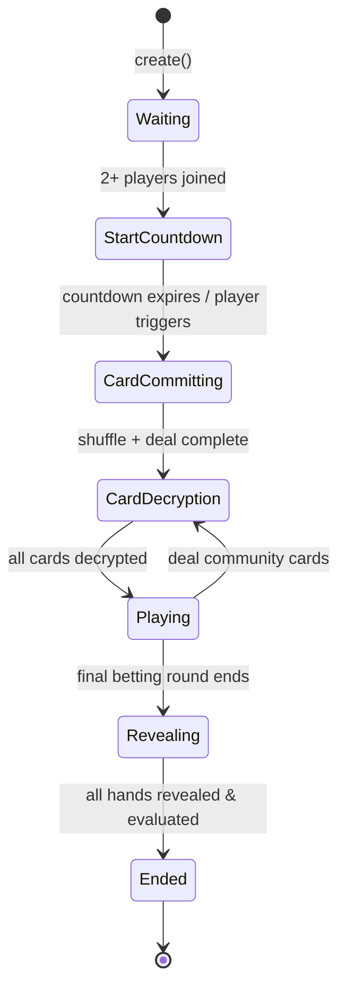

# Tables, Joining & Buy-In

## Table Creation

Tables are created through factory contracts using OpenZeppelin's **Clones** (minimal proxy pattern). A single `PokerTable` implementation is deployed once, and each new table is a lightweight clone initialized with its own parameters.

### PokerTableFactory

```solidity
function createTable(
    uint256 smallBlind,
    uint256 bigBlind,
    uint256 minBuyIn,
    uint256 maxPlayers,
    address asset,          // ERC20 token address (stAVAX), or address(0) for native CX
    uint256 securityDeposit
) external returns (address)
```

**Validation rules:**
- `smallBlind > 0`
- `bigBlind > smallBlind`
- `minBuyIn >= 20 * bigBlind`
- `maxPlayers` between 2 and 9

Each clone is initialized with the shared `MLEncryptedCardGame` instance, a `PokerEvaluator`, the chosen asset, security deposit amount, an optional trusted forwarder (for gasless play), and an admin address.

### Factory View Functions

```solidity
getTableCount() → uint256              // Total tables created
getAllTables() → address[]             // All table addresses
getTableDetails(address, uint256) → TableDetails  // Table + round info
```

## Creating a Round

Once a table exists, any player can start a new round:

```solidity
function create(
    uint256 smallBlind,
    uint256 bigBlind,
    uint256 minBuyIn,
    uint8   maxPlayers
) external returns (uint256 roundId)
```

This creates a new round with a unique `roundId`, initializes the card game in `MLEncryptedCardGame`, and opens registration.

## Joining a Game

```solidity
function join(
    uint256 roundId,
    uint8   seatNumber,
    Point calldata publicKey  // BabyJubJub public key for card encryption
) external payable
```

### Payment

The player must send exactly `minBuyIn + securityDeposit`. Tables currently use **stAVAX** (`0xf8fb25e56b45ee720a30b8dc82fadab1f74f7367`) as the wagering token:

- **stAVAX (ERC20)**: Approve the table contract first, then call `join()` (uses `SafeERC20.safeTransferFrom`)
- **stAVAX with permit**: Use `joinWithPermit()` to approve + join in one transaction
- **Native CX**: Alternatively, tables can be configured with `asset = address(0)` to use native CX, sent as `msg.value`

### Seat System

Available seats are tracked with a **bitmask** (`uint256 availableSeats`). Each bit represents one seat (0 through `maxPlayers - 1`). When a player joins:

1. The requested seat bit is checked — must be set (available)
2. The bit is cleared to mark the seat as taken
3. The player's `seatNumber` is stored in their `PlayerInfo`

```
availableSeats = 0b111111111  (9 seats open)
Player takes seat 3:
availableSeats = 0b111110111  (seat 3 now taken)
```

### Key Registration

The `publicKey` parameter is a point on the BabyJubJub curve. It is forwarded to `MLEncryptedCardGame.register()`, which:

1. Stores the player's public key
2. Adds it to the **aggregated public key** via elliptic curve point addition
3. Assigns the player a sequential `playerId` within the game

The aggregated public key is later used to encrypt the deck so that all players' keys must participate in decryption.

## Game State Machine

### Poker States



| State | Description |
|-------|-------------|
| **Waiting** | Round created, waiting for players to `join()` |
| **StartCountdown** | 2+ players present; 10-second countdown before game begins |
| **CardCommitting** | Shuffle phase — each player submits their shuffle with ZK proof |
| **CardDecryption** | Players submit decryption layers for dealt cards |
| **Playing** | Active betting round (PreFlop, Flop, Turn, or River) |
| **Revealing** | Final reveal — active players prove their hole cards |
| **Ended** | Hands evaluated, pot distributed, deposits refunded |

### Countdown

When the second player joins a round in `Waiting` state, the game transitions to `StartCountdown` and records `lastStateChangeTime`. After `COUNTDOWN_DURATION` (10 seconds), any player can trigger the transition to `CardCommitting`.

Additional players may still join during the countdown if seats remain.

## Security Deposits

Each player pays a **security deposit** on top of their buy-in. This deposit:

- **Prevents griefing**: Players who stall (fail to shuffle, decrypt, or act within timeouts) can have their deposit slashed
- **Is refunded**: At the end of a normal game, all deposits are returned
- **Amount**: Configured per-table at creation time

```solidity
struct PlayerInfo {
    uint256 buyIn;          // Chips available for betting
    uint256 currentBet;     // Current round bet
    uint256 totalBet;       // Total wagered this hand
    uint8   seatNumber;
    bool    hasFolded;
    bool    isAllIn;
    // ...
}
```

## Constants

| Constant | Value |
|----------|-------|
| Max players per table | 9 |
| Deck size | 52 |
| Countdown duration | 10 seconds |

## Events

```solidity
event RoundCreated(uint256 indexed roundId, uint256 smallBlind, uint256 bigBlind, uint256 minBuyIn);
event PlayerJoined(uint256 indexed roundId, address indexed player, uint256 buyIn, uint8 seatNumber);
event GameStateChanged(uint256 indexed roundId, GameState newState);
event CountdownStarted(uint256 indexed roundId, uint256 timestamp);
event GameStarted(uint256 indexed roundId);
```
